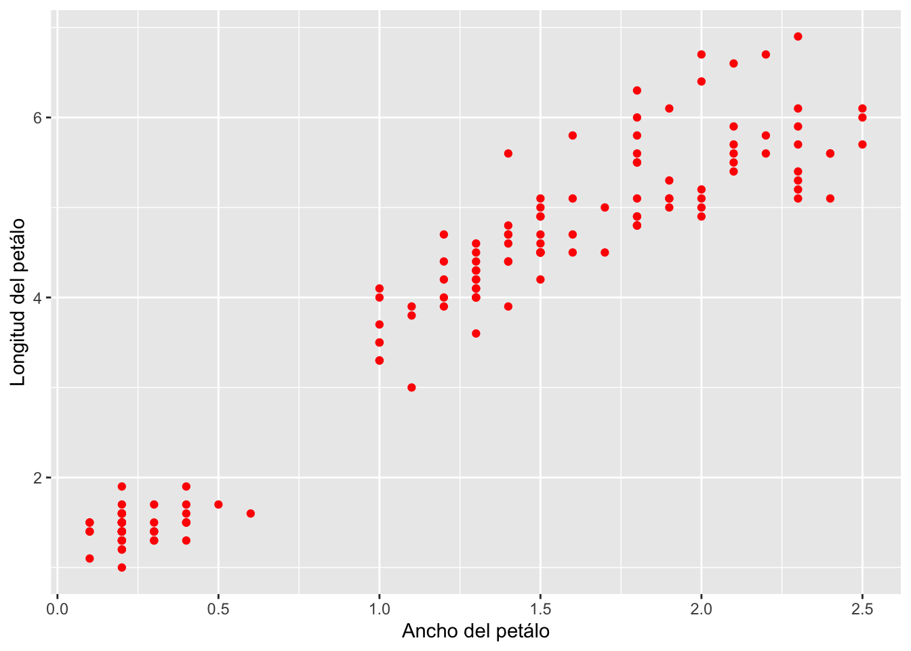
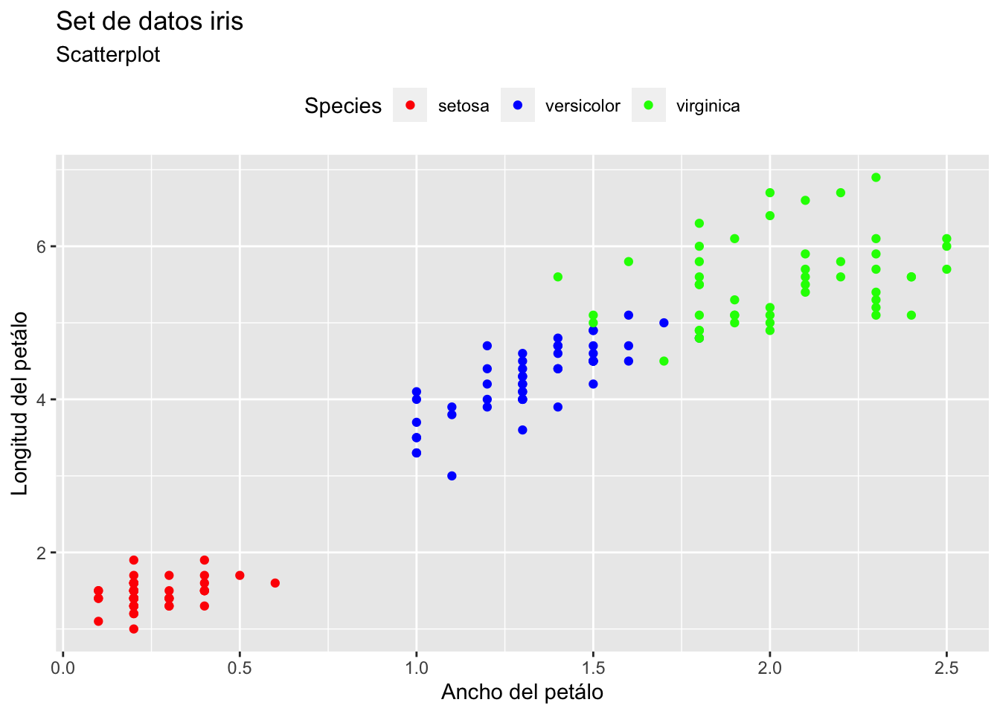
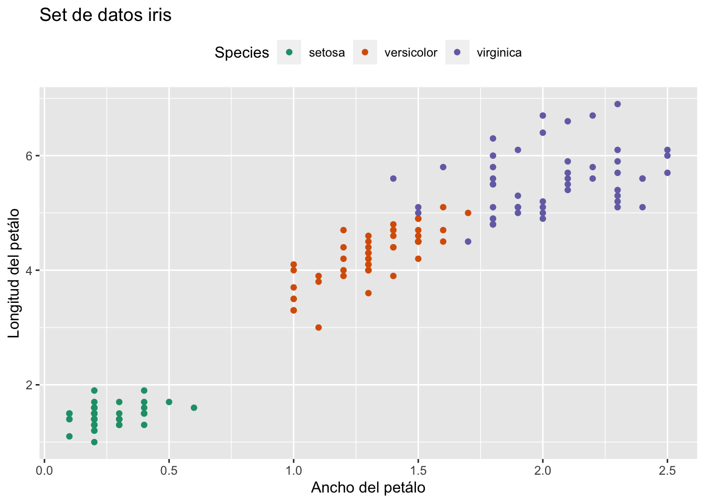
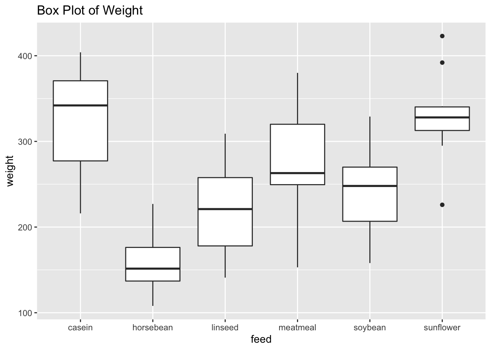

# Gráficos en R

R es un lenguaje de programación y entorno computacional dedicado a la estadística que dispone de múltiples funciones diseñadas para la representación gráfica de datos.

Revisa la presentación completa [aquí](https://drive.google.com/u/0/uc?id=1t_zGzI25aQp3j3ffs1RnIcyUzgee7azf&export=download)


## Tipos de gráficos en R

Existe una gran variedad de gráficos que pueden utilizarse según el tipo de datos que se tengan.


[Fuente](https://www.r-graph-gallery.com/)

## Paqueterías para graficar en R

Existen diversas paqueterías en R que facilitan la creación de gráficos. Cada paquetería permite crear diversos tipos de gráficos.

+ **[graphics](https://www.rdocumentation.org/packages/graphics/versions/3.6.2)**
+ [grid](https://cran.r-project.org/package=grid) 
+ [Lattice](https://cran.r-project.org/web/packages/lattice/lattice.pdf)
+ **[ggplot2](https://cran.r-project.org/package=ggplot2)**
+ [gganimate](https://cran.r-project.org/package=gganimate)
+ [Highcharts](https://cran.r-project.org/package=highcharter)
+ [bbplot](https://github.com/bbc/bbplot)
+ [ggfortify](https://cran.r-project.org/package=ggfortify)


## Gráficos de base R

R cuenta con el paquete base de graphics para la construcción de gráficos. La función `plot` es la función básica que permite crear:

+ Líneas 
+ Barras
+ Boxplots
+ Matrices de dispersión

## Paletas de colores en R 

Los colores son uno de los elementos esenciales de un gráfico. Forman parte de la estética y por tanto, los podemos utilizar tanto para representar variables, como para destacar elementos dentro de la visualización.

[Aquí](http://www.stat.columbia.edu/~tzheng/files/Rcolor.pdf) y [aquí](https://htmlcolorcodes.com/) puedes revisar los colores disponibles en R que puedes usar en tus gráficas.

## ggplot2

[ggplot2](https://cran.r-project.org/package=ggplot2) es una de las paqueterías más populares en R para crear una gran variedad de gráficos. `ggplot2` es un sistema para la creación declarativa de gráficos basado en la gramática de gráficos. En esta gramática, se separan los elementos o las partes de un gráfico en diferentes capas o layers, y así es más fácil modificarlos.

`ggplot2` funciona a través de la grámatica de gráficos donde se dan los datos, las variables que queremos a graficar y la geometría deseada.

Instalación de ggplot2

```r
install.packages("tidyverse")
install.packages("ggplot2")
```

Cargar la librería de trabajo

```r
library(ggplot2)
```

Importamos el set de datos que puedes descargar de [aquí](https://drive.google.com/u/0/uc?id=1TlR9xgKl7Laf8-SNwoq3W2MXkD19AQ9d&export=download)


```r
datos <- read.csv("iris.csv")
```


```r
head(datos)
```

```
##   Sepal.Length Sepal.Width Petal.Length Petal.Width Species
## 1          5.1         3.5          1.4         0.2  setosa
## 2          4.9         3.0          1.4         0.2  setosa
## 3          4.7         3.2          1.3         0.2  setosa
## 4          4.6         3.1          1.5         0.2  setosa
## 5          5.0         3.6          1.4         0.2  setosa
## 6          5.4         3.9          1.7         0.4  setosa
```

### Scatterplots
Vamos a crear un gráfico ddel tipo scatterplot muy básico con ggplot2. 

```r
ggplot(datos, aes(x = Petal.Width, y = Petal.Length)) + 
  geom_point()
```


Ahora vamos a colorear todos los puntos utilizando `geom_point(color)`. Para agregar las etiquetas de los ejes usamos `labs()` como se muestra a continuación.


```r
ggplot(datos, aes(x = Petal.Width, y = Petal.Length)) + 
  geom_point(color="red")+
  labs(x = "Ancho del petálo" ,y = "Longitud del petálo")
```




Con el argumento `color` coloreamos por especie de flor. 

```r
ggplot(datos, aes(x = Petal.Width, y = Petal.Length, color=Species)) + 
  geom_point()+
  labs(x = "Ancho del petálo" ,y = "Longitud del petálo")
```


`shape` permite modificar la forma del punto. En este caso vamos a poner diferentes puntos según la especie de flor . Con `ggtitle` agregamos un título a nuestro gráfico.

```r
ggplot(iris, aes(x = Petal.Width, y = Petal.Length, color=Species, shape=Species)) + 
  geom_point(size=3) +
  theme_bw()+
  labs(x = "Ancho del petálo" ,y = "Longitud del petálo")+
  ggtitle("Set de datos iris")
```


Otra opción para modificar los colores es utilizando `scale_colour_manual()`. Con este argumento indicamos los colores que queremos usar para nuestro gráfico basados en la paleta de colores. 


```r
ggplot(iris, aes(x = Petal.Width, y = Petal.Length, color=Species)) + 
  geom_point()+
  labs(x = "Ancho del petálo" ,y = "Longitud del petálo", 
       title = "Set de datos iris", subtitle = "Scatterplot")+
  theme_grey()+
  theme(legend.position = "top")+
  scale_colour_manual(values=c("red", "blue", "green"))
```




### RcolorBrewer

RcolorBrewer es una paquetería exclusiva de colores que podemos usar en nuestros gráficos.

```r
install.packages("RColorBrewer")
```

```r
library(RColorBrewer)
```

Conocer todas las paletas de colores disponibles en RColorBrewer.

```r
display.brewer.all()
```


Vamos a elegir la paleta "Dark2" para personalizar nuestro gráfico. Usamos el argumento `scale_colour_brewer()` como se muestra a continuación


```r
ggplot(iris, aes(x = Petal.Width, y = Petal.Length, color=Species)) + 
  geom_point()+
  labs(x = "Ancho del petálo" ,y = "Longitud del petálo", 
       title = "Set de datos iris")+
  theme_grey()+
  theme(legend.position = "top")+
  scale_colour_brewer(palette="Dark2")
```




### Boxplots

R contiene varios sets de datos ya pre-cargados con los que podemos trabajar. Para conocer los sets disponibles usamos:


Para este ejercicio vamos a elegir el set de datos **chickwts**. La información de este set de datos se uso para medir y comparar la efectividad de varios suplementos alimenticios en la tasa de crecimiento de los pollos.

```r
head(chickwts)
```

```
##   weight      feed
## 1    179 horsebean
## 2    160 horsebean
## 3    136 horsebean
## 4    227 horsebean
## 5    217 horsebean
## 6    168 horsebean
```

Vamos a crear un boxplot básico.

```r
ggplot(chickwts, aes(y = weight, x= feed)) + 
  geom_boxplot()+ggtitle("Box Plot of Weight")
```



`theme()` permite modificar varios elementos del gráfico. En esta ocasión lo usaremos para rotar las etiquetas del eje x.

```r
ggplot(chickwts, aes(y = weight, x= feed)) + 
  geom_boxplot()+ggtitle("Box Plot of Weight")+
  theme(text = element_text(size=10),
        axis.text.x = element_text(angle=90, hjust=1))
```


Coloreamos el gráfico por tipo de alimentación que se le dio a los pollos. 

```r
ggplot(chickwts, aes(y = weight, x= feed, fill=feed)) + 
  geom_boxplot()+
  ggtitle("Dataset chickwts")+
  theme(text = element_text(size=10),
        axis.text.x = element_text(angle=90, hjust=1))+
  labs(subtitle = "Boxplot", y= "peso", x="alimento")
```


